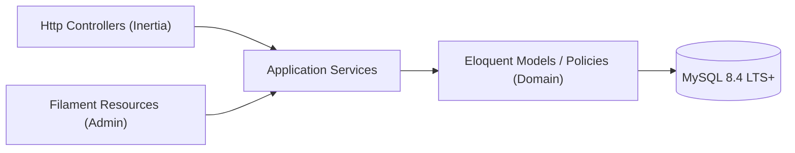
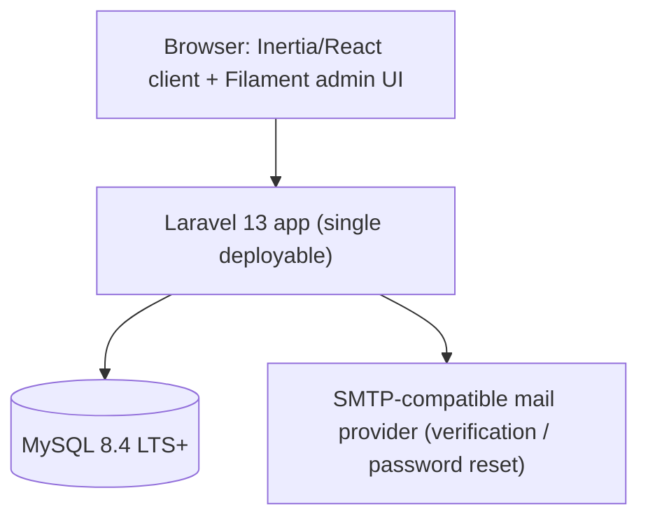
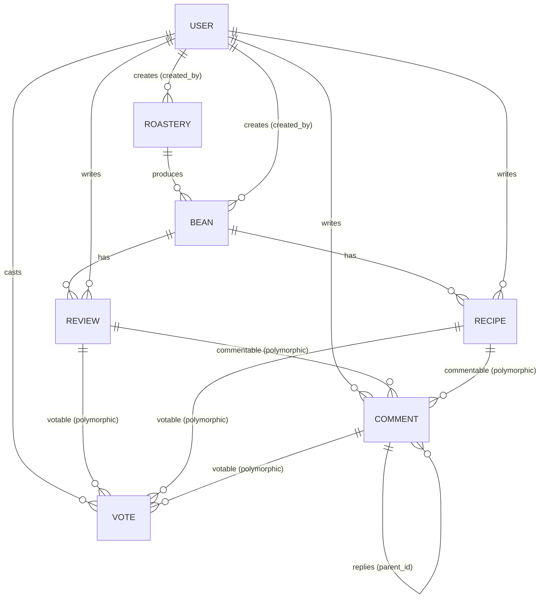

# Architecture Spine — BeansJourney

## Design Paradigm

Layered MVC with an Application Service layer, Laravel-idiomatic: Eloquent models double as the domain layer `[ADOPTED]` (Laravel convention). Two presentation surfaces — the Inertia/React client and the Filament admin panel — sit side by side over one shared Application/Domain layer; neither is a separate backend.



## Invariants & Rules

### AD-1 — Relational data engine

- **Binds:** CAP-1, CAP-2, CAP-3, CAP-4, CAP-5, CAP-6, CAP-7, CAP-8
- **Prevents:** A relational-vs-NoSQL split-brain across services for the same threaded content.
- **Rule:** MySQL 8.4 LTS+ is the single system of record. Threaded comments are modeled relationally (adjacency list), never as a document store. `[ASSUMPTION]` Engine choice (MySQL vs PostgreSQL) was not specified by the user; MySQL is Laravel's most common default and simplest to host. PostgreSQL is an equally valid substitute — revisit if full-text search is added later. This resolves the spec's open question: relational is sufficient at MVP scale.

### AD-2 — Polymorphic comment model

- **Binds:** CAP-3, CAP-4
- **Prevents:** Two separate comment implementations (review-comments vs. recipe-comments) drifting in shape, moderation, or upvote logic; orphaned reply threads from a hard-deleted parent comment.
- **Rule:** A single `comments` table (`commentable_type`/`commentable_id` → `Review` or `Recipe`) with a nullable `parent_id` self-reference for nested replies. Both thread types reuse the same table, policy, and service. Comments are soft-deleted only (`deleted_at`) — never hard-deleted — and a deleted comment renders as a `[deleted]` placeholder so its replies stay attached and visible.

### AD-3 — Polymorphic vote model

- **Binds:** CAP-3, CAP-4
- **Prevents:** Duplicate or divergent per-entity vote tables letting a user vote twice on the same item via different code paths, or inconsistent uniqueness rules across votable types.
- **Rule:** A single `votes` table (`votable_type`/`votable_id` → `Review`, `Recipe`, or `Comment`) plus `user_id`, unique on (`votable_type`, `votable_id`, `user_id`). Votes are upvote-only per the spec (no downvote) — a row's presence *is* the vote; there is no `value`/direction column. Casting a vote again deletes the row (toggle-off); it never flips a value.

### AD-4 — Shared application layer across both presentation surfaces

- **Binds:** all capabilities, especially CAP-8
- **Prevents:** Admin-side mutations (Filament actions) reimplementing or diverging from client-side business rules for the same entity (Bean, Review, Recipe, Comment, User); DB-level side effects silently bypassing that shared logic.
- **Rule:** All writes to shared entities go through Application Services that accept plain arguments (no `Http\Request` dependency). Both Inertia controllers and Filament resources call these services — neither surface mutates Eloquent models directly for these entities. Two enforcement clauses close the gaps a "just don't do it" rule would leave open: (1) every Filament Resource for a governed entity (Bean, Roastery, Review, Recipe, Comment, User role) must override its create/update/delete lifecycle hooks to call the matching Service instead of relying on Filament's default direct Eloquent save/delete; (2) foreign keys from `comments`/`votes` to their parents use `RESTRICT`, never `ON DELETE CASCADE` — cleanup on delete (counters, soft-delete cascades, notifications) always runs through a Service, not a DB trigger. A Review/Recipe/Comment's own author may soft-delete their own post; an admin may soft-delete any post via Filament — both call the same Service delete method with a different actor, never a separate code path.

### AD-5 — Auth boundary

- **Binds:** CAP-5, CAP-6, CAP-8
- **Prevents:** A verified regular user reaching the admin panel, or ambiguity over which guard governs which surface or which routes the verification gate covers.
- **Rule:** Laravel's native auth (Fortify/Breeze conventions) with `MustVerifyEmail` on the `web` guard shared by Inertia. `users.role` enum (`user`|`admin`). Filament panel `canAccessPanel()` requires `role = admin`. The `auth` + `verified` middleware gates every mutating client route — create, update, delete, and vote-toggle — for beans, roasteries, reviews, recipes, comments, and votes, not just initial creation.

### AD-6 — Dependency direction

- **Binds:** all
- **Prevents:** Domain (Models/Policies) depending on `Http` or `Filament` namespaces, or Services becoming unusable from Filament because they expect an `Http\Request`.
- **Rule:** Http Controllers and Filament Resources both depend on Application Services; Services depend on Models/Policies; Models never depend upward. (See the Design Paradigm diagram above.)

### AD-7 — Bean / Roastery authorship

- **Binds:** CAP-1, CAP-2, CAP-8
- **Prevents:** Two independently-built stories assuming opposite owner models for the same `Bean`/`Roastery` — e.g. one letting the original submitter keep editing it, another assuming only admins ever can.
- **Rule:** Any verified user may create a new `Bean` (and its `Roastery`, via find-or-create-by-name if it doesn't already exist), recorded via `Bean.created_by` / `Roastery.created_by`. After creation, editing an existing `Bean` or `Roastery` is admin-only via Filament (CAP-8) — the creating user does not retain standing edit rights.

## Consistency Conventions

| Concern | Convention |
| --- | --- |
| Naming (entities, files, interfaces, events) | snake_case DB tables/columns; PascalCase singular Eloquent models (`Bean`, `Roastery`, `Review`, `Recipe`, `Comment`, `Vote`, `User`); kebab-case Inertia routes matching `resources/js/Pages` folder names; Filament resources named `{Model}Resource` |
| Data & formats (ids, dates, error shapes, envelopes) | bigint auto-increment PKs; UTC timestamps via Eloquent `created_at`/`updated_at`; dates serialized ISO 8601 to the client; validation errors via Laravel's standard Inertia shared `errors` prop (no custom envelope) |
| State & cross-cutting (mutation, errors, logging, config, auth) | All writes to `Bean`/`Roastery`/`Review`/`Recipe`/`Comment`/`Vote` route through Services (never direct from controllers/Filament actions); one Policy per model, checked in both Http controllers (`$this->authorize`) and Filament resource `can*` hooks; verified-email requirement enforced via the `verified` middleware alias on every mutating client route |

## Stack

| Name | Version |
| --- | --- |
| PHP | 8.3+ (Laravel 13 minimum) |
| Laravel | 13 |
| Filament | v5.7.4+ (earlier v5 releases had an `illuminate/contracts` conflict with Laravel 13, resolved by 5.7.4) |
| Inertia protocol / `inertiajs/inertia-laravel` | v3 |
| `@inertiajs/react` | ^3.6 |
| React | ^19.2.1+ (19.0–19.2.0 carry CVE-2025-55182, an RSC/Flight-protocol RCE; this stack doesn't use React Server Components so it's likely non-exploitable here, but pin the patched floor rather than leaving it open) |
| MySQL | 8.4 LTS+ (8.0 line reached EOL April 2026) |

## Structural Seed



**Deployment & environments** `[ASSUMPTION]` — not specified by the user: a single Laravel deployable across `local` (Sail/Docker) and `production` environments via `.env`; queue driver starts as `database` (sync-safe, no extra infra), can move to Redis later; specific hosting provider left open.

`Recipe.brew_method` is a fixed enum (`americano`, `espresso`, `v60`, `french_press`, `aeropress`, `tubruk`, `other`) and `Recipe.tools` is a JSON column (machine/grinder/dripper as free key-value pairs) rather than a normalized `Tool` entity — the simplest shape that satisfies CAP-4 at MVP scale. `[ASSUMPTION]` exact tools shape wasn't specified beyond the user's examples; revisit if tools need to become filterable/structured later. User activity history (CAP-8) is recorded via an `activity_log` table (actor, action, subject type/id, timestamp) written by the Application Services layer, since Services already sit on every mutation path (AD-4).



```text
app/
  Http/
    Controllers/    # Inertia controllers, thin
    Requests/        # Form Request validation
  Filament/
    Resources/       # Admin CRUD (Bean, Roastery, Review, Recipe, Comment, User) -- create/update/delete hooks call Services per AD-4
    Widgets/          # Basic analytics (CAP-8) -- not a Resource
  Models/             # Bean, Roastery, Review, Recipe, Comment, Vote, User, ActivityLog
  Policies/           # one per model
  Services/           # CreateBean, CreateReview, CreateRecipe, ToggleVote, DeletePost, ...
resources/
  js/
    Pages/            # Inertia page components (React)
    Components/
database/
  migrations/
  factories/
  seeders/
routes/
  web.php             # Inertia routes (Filament panel provider registers its own)
```

## Capability → Architecture Map

| Capability / Area | Lives in | Governed by |
| --- | --- | --- |
| CAP-1 Roastery / provenance | `Models/Roastery`, `Models/Bean` | AD-1, AD-7, paradigm |
| CAP-2 Beans list, detail & user submission | `Http/Controllers/BeanController`, `Pages/Beans/*`, `Services/CreateBean` | AD-1, AD-5, AD-7, paradigm |
| CAP-3 Review threads | `Models/Review`, `Services/ReviewService` | AD-2, AD-3, AD-4 |
| CAP-4 Recipe threads | `Models/Recipe`, `Services/RecipeService` | AD-2, AD-3, AD-4 |
| CAP-5 Register & email verify | `Http/Controllers/Auth/*` | AD-5 |
| CAP-6 Password reset | `Http/Controllers/Auth/*` | AD-5 |
| CAP-7 Profile edit | `Http/Controllers/ProfileController` | AD-5 |
| CAP-8 Admin console (incl. activity log, analytics) | `Filament/Resources/*`, `Filament/Widgets/*`, `Models/ActivityLog` | AD-4, AD-5, AD-7 |

## Deferred

- MySQL vs. PostgreSQL — see AD-1 assumption; revisit if full-text search becomes a requirement.
- Search/filter over beans — not requested by any capability.
- Rate limiting / spam moderation beyond manual admin moderation.
- Deployment target/provider (Forge, Vapor, plain VPS, etc.) — not specified.
- Image/photo upload for beans or roastery branding — not requested.
- In-app notifications beyond transactional email (e.g. reply/upvote alerts).
- Role system beyond a simple `user`/`admin` tier — none requested by SPEC-beansjourney.
